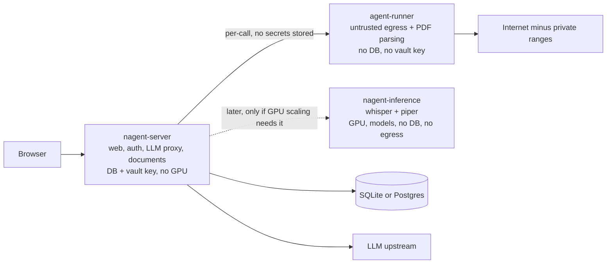

# Architecture and security roadmap

Status: living plan, reviewed against the current source on 2026-10-05; the working tree contains uncommitted changes. Priorities are in section 6.

The plan is written from two seats: the **software architect** (is the system cut along the right seams, can it evolve cheaply) and the **security architect** (what can an attacker reach, how far, and how fast would we notice). Items are labelled:

- **Structure** packages (A-I): refactors with no operator-visible behavior change.
- **Hardening** items (`S-*` security, `R-*` resource): they add limits, knobs, headers, manifests or CI gates, so they update docs and config examples in the same commit (AGENTS.md section 5), pick safe defaults, and get their own tests.

Every commit keeps `cargo fmt`, `cargo clippy`, `cargo test`, `cargo audit` and `cargo deny` green. `docs/architecture.md` is updated whenever the breakdown changes.

## 1. Where the project stands

| Crate | Lines | Role |
|---|---|---|
| `stt-proto` | ~0.4k | Wire types and postcard codec. |
| `stt-core` | ~1.2k | Whisper backend trait, mock, real backend, worker pool. Minor: `mock.rs` / `whisper_backend.rs` could sit under `backend/`. |
| `nagent-support` | ~1.9k | Bounded primitives: token-bucket and windowed-bucket maps, `TtlMap`, `run_bounded` (queue depth and wait timeout). |
| `nagent-db` | ~4.7k | `Db` with private per-domain repositories, `for_user` / `admin` capability views, migrations, row types; raw-SQL helpers behind `test-util`; Postgres CI job. |
| `nagent-agents` | ~8.6k | `Agent` trait with policy metadata, static descriptor table, registry, `SecretSource` / `DocumentSource`, 9 agents behind per-agent features, `egress`, `ServiceRegistry`, `SecretCache` on `TtlMap`. |
| `nagent-tts` | ~1.1k | Piper engine. |
| `nagent-server` | ~21.6k src + ~7.5k tests Rust, ~11k JS/CSS | Composition root: config, state, http, auth, credentials, documents, chat, llm, stt, oauth, cli. No `sqlx`. |

Strengths worth protecting: crate boundaries that match the dependency direction (`nagent-agents` has no `sqlx`, no server types); capability views that make cross-user queries unrepresentable for every user-bound domain; one construction site for hardened outbound HTTP; bounded CPU work (Argon2, PDF, TTS) with `503` + `Retry-After` on saturation; a default-deny egress `NetworkPolicy` with no ServiceAccount token; supply-chain gates in CI (`cargo audit`, `cargo deny`, Dependabot, CycloneDX and Syft SBOMs); a Postgres service job for the repository tests; zero-copy static serving with per-file `ETag` and `304`; `docs/architecture.md`.

## 2. Target architecture

The project is cut along three axes at once: **dependency layers**, **trust zones** and **resource profile** (GPU/CPU-heavy inference versus light I/O).

### 2.1 Layers

```
nagent-support
   -> config
   -> nagent-db
   -> auth, credentials
   -> nagent-agents (agents + egress), documents, chat, (memory, sources)
   -> llm, nagent-tts, stt
   -> http, cli, app, main
```

A component depends only on layers above it. Cross-layer needs go through a small trait or narrow context type owned by the lower layer. Crate boundaries enforce this at compile time where they exist; package D adds a test for the module-level edges inside `nagent-server`.

### 2.2 Trust zones (target runtime)



- **`nagent-server`**: the only component holding database credentials and the vault key; light, no GPU libraries.
- **`agent-runner`** (package G): the only component allowed to reach arbitrary Internet hosts and parse untrusted documents; no secrets, no DB.
- **`nagent-inference`** (optional): whisper and piper on GPU nodes, model volume, no DB, no egress. Worth it only when GPU scaling or availability requires it; it needs short-lived signed tokens for `/ws` and `/v1/audio/*` plus inter-tier authentication (mTLS or mesh). `nagent-tts` keeps the option open.

Decisions recorded: `auth` and `credentials` stay in the server crate (imported by `http`, `state`, `documents` and every route; revisit once OIDC is implemented). SQL stays per engine inside each repository (no `sqlx::Any`). `nagent-agents` reaches secrets and documents only through traits the server implements.

### 2.3 Server module layout (target)

```
src/
  main.rs app.rs state.rs testing.rs
  config/        one definition per section (Deserialize + defaults + validation + tests); file.rs = root loader only
  http/          route classes, security headers, static serving, index/health/version, features, build_router
  auth/ oauth/ credentials/ documents/ chat/ llm/ stt/ cli/
  (reserved, not created now: memory/, sources/)
```

## 3. Findings

### 3.1 Structure

1. **Config is defined three times per option.** For agents: the plain struct in `nagent-agents`, a runtime mirror in `config/agents.rs` converted by `impl From<crate::config::X> for nagent_agents::XAgentConfig` (`agents/mod.rs`), and a `Toml*` mirror in `config_file.rs` (1439 lines, 20 structs). Every option follows the pattern: the recent `llm_max_auto_continues` knob and its move to `[llm]` each edited the runtime struct, the TOML mirror, the merge function and the fixtures. The move of `llm_max_tool_rounds` / `llm_max_auto_continues` from `[agents]` to `[llm]` is an example of a key move done without an alias, which is acceptable while configuration compatibility is not a constraint (decision 14).
2. **`AppState` glue.** Six `Option<…State>` fields on `AppState`, `Arc*` newtypes that exist only to satisfy `FromRef`, and an `AuthState` that mixes auth with `services`, the credential resolver and the vault key.
3. **Cross-cutting HTTP policy is split across middleware and handlers.** `RequireAuth` applies method-aware CSRF checks to authenticated mutations, while explicit `check_csrf` calls remain in handlers. Body limits, non-streaming timeouts, Origin/Host validation and WebSocket admission are wired in `http::build_router`, but there is no route-class abstraction or general HTTP concurrency/load-shedding policy. Keep those protections centralized and make new routes opt into a clear route class by construction.
4. **Route ownership is inconsistent.** `chat::sessions::mint_handler` is mounted from `documents/routes.rs`; the index, health, version and static handlers live in `stt/ws_handler.rs`; `/api/features` is assembled from individual state fields; `http::build_router` knows every subsystem.
5. **Shared egress pools need enforcement.** `EgressPool` now provides clients per policy class; verify every network agent uses those shared pools and avoid creating per-agent pools. The LLM client remains a separate trust/policy boundary.
6. **No layering test.** Nothing checks the direction in 2.1 or the capability rules inside `nagent-server` (`.admin()` only in `cli/` and the purge job, `reqwest::Client` only in egress and the LLM client, vault key types only under `credentials/`).
7. **Workspace hygiene.** The new crates still pin versions inline (`nagent-db` 3, `nagent-agents` 4, `nagent-tts` 1 entries) instead of `[workspace.dependencies]`; `.dockerignore` still whitelists `crates/stt-server/src/static/...` and `.gitignore` ignores the old `version.txt` path; about 60 comments, `deny.toml` and manifests cite internal plan numbers ("plan 4.A", "plan S10", "PR1") that mean nothing to a future reader (AGENTS.md section 4); `stt-server` still appears in user-facing messages and several test names; `docs/architecture.md` still says "six crates" and omits `nagent-tts`.
8. **`nagent-db` features are markers.** `db-sqlite` / `db-postgres` gate a few helper blocks, but both sqlx drivers are always linked and the per-domain modules import them unconditionally, so slim builds are impossible (decision 2).
9. **`oauth/` has no consumer yet** (OIDC backend is still a stub, `501`).
10. **No observability.** No request id, no `TraceLayer`, no `/metrics`, no `with_graceful_shutdown`; the access log exists but there is nothing to alert on.
11. **Frontend** (package H): no module boundary (`chat.js` 4048 lines and still growing, `audio.js` 933, `style.css` 2529, `index.html` 607); modules load before the app shell exists and talk through `window.__nagent*` globals; every page load fetches ~1.2 MB raw from 16 blocking script tags; the 11 MB VAD wasm and 2.3 MB model are fetched with only a 5-minute `max-age`; assistant bubbles are re-rendered from scratch per streamed token; the Deno tests in `scripts/verify-*.ts` run nowhere (not in `Makefile`, CI or README) while `tests/static_assets.rs` (1594 lines) guards the UI by substring-matching source.
12. **Tests**: flat `tests/*.rs`; `static_assets.rs` 1594 and `agents.rs` 1475 lines; large inline test blocks in `config_file.rs`, `config/auth.rs`.
13. **Coupling at the top.** `llm/` (~2.9k lines, `prompt.rs` 694 and `privacy.rs` 477 growing, the tool loop gaining heuristics such as auto-continue) imports `agents`, `state` and `config`; extracting it would shorten the compile-test loop (package F).

### 3.2 Resource consumption

| # | Finding | Evidence |
|---|---|---|
| R-1 | Partial safeguards are now present: protected routes have a body cap, non-streaming timeout and shared per-IP rate limit; WebSocket upgrades have global and per-IP caps. Remaining gap: no general per-route HTTP concurrency limit or load shedding, and per-IP request limits do not cap concurrent or expensive LLM generations. Streaming LLM responses are intentionally outside the request timeout; see R-8 to R-10. | `http/mod.rs`, `http/llm_guards.rs`, `stt/ws_concurrency.rs` |
| R-2 | TTS: the global `synth_lock` still serializes synthesis, the per-voice `Piper` cache never evicts (tens of MiB per ONNX session), and it is read with `.expect("piper voice cache poisoned")`, so one panic while locked breaks TTS until restart. | `nagent-tts/src/lib.rs` |
| R-3 | PDF extraction clones the payload (`bytes.to_vec()`) and its worker cannot be cancelled after a timeout; `documents/storage.rs` reads whole files with blocking `std::fs::read`. | `documents/extract.rs`, `documents/storage.rs` |
| R-4 | Build and image: `tokio` with `full`; sqlx always builds both drivers; the Docker builder is `rust:1.81` while CI uses stable (verify the image still builds: dependencies may need a newer rustc); the "dependency caching" step copies all sources first so it never caches; `HEALTHCHECK` calls `wget`, absent from `debian:bookworm-slim` (probably always unhealthy under plain Docker; Kubernetes uses `httpGet`). | `Cargo.toml`, `Dockerfile` |
| R-5 | Kubernetes: `latest` image tag, no `startupProbe` (model load covered by `initialDelaySeconds: 30`), no ephemeral-storage limit, no `emptyDir` for `/tmp` on a read-only root, no graceful drain of WebSockets and SSE, single replica with `Recreate`. | `deploy/k8s/base/deployment.yaml` |
| R-6 | Static serving leftovers: first-party assets now revalidate with `ETag`, but vendor files only get `max-age=300` and `build.rs` hashes the whole `static/` tree once (stale-page check), so immutable caching needs the content-addressed vendor URLs of package H; no compression layer. Do not compress SSE. | `http/static_assets.rs`, `build.rs` |
| R-7 | One egress pool per policy class; retain the LLM client as a separate policy boundary. Verify all network agents use the shared pool and do not create private pools. | `nagent-agents/src/egress.rs`, `app.rs` |
| R-8 | LLM SSE parsing buffers incomplete frames and accumulates assistant text, reasoning and tool arguments without hard caps. Proxy and egress error paths call `.text()` before truncating, so the apparent log/result truncation does not bound memory. Cap frame size, per-round accumulation, tool count/argument bytes, and upstream error-body reads. | `llm/sse.rs`, `llm/proxy.rs`, `nagent-agents/src/egress.rs` |
| R-9 | A client disconnect can leave partial tool calls in the round outcome; the tool loop may continue dispatching them, including write-capable agents. Propagate cancellation and check it before dispatch; define the completion contract for already-started writes. | `llm/sse.rs`, `llm/tool_loop.rs` |
| R-10 | The `/v1/*` limiter keys on the TCP peer `ConnectInfo`, while STT resolves forwarded addresses only for trusted proxies. Behind a proxy, unrelated clients share one bucket. Use the same trusted-proxy resolver for HTTP and WS; add per-user concurrent-generation and cost budgets. | `http/llm_guards.rs`, `rate_limit.rs`, `stt/ws_handler.rs` |

### 3.3 Security

Attack surface in order of reachability: unauthenticated HTTP and WebSocket endpoints; authenticated API; LLM tool calls driven by untrusted content (prompt injection); uploaded documents; the supply chain; the cluster.

| # | Finding | Evidence |
|---|---|---|
| S-1 | Core transport bounds are implemented for protected HTTP routes and WS admission; the remaining denial-of-service risks are unbounded upstream SSE/error accumulation (R-8), concurrent expensive generations and cancellation (R-9/R-10), plus the unauthenticated single-user deployment mode in S-5. | R-1, R-8 to R-10 |
| S-2 | Origin checks on state-changing routes and Host/Origin checks on WS upgrades are now wired through `http::origin_guard`; keep forged-header and reverse-proxy cases covered. This does not make a non-loopback server safe when auth is disabled; see S-5. | `http/origin_guard.rs`, `http/mod.rs`, `stt/ws_handler.rs` |
| S-3 | Authenticated mutating requests now pass through method-aware CSRF validation in `RequireAuth`; explicit handler checks remain duplicated. Preserve middleware coverage and consolidate duplicates with route classes rather than treating CSRF as absent. | `auth/middleware.rs`, `http/mod.rs` |
| S-4 | HTTP hardening gaps: CSP and `frame-ancestors` are set, but no HSTS option, no `Permissions-Policy` (microphone and geolocation `self` only), no COOP/CORP, `Cache-Control: no-store` only on agent and LLM routes; session cookie is `HttpOnly; SameSite=Lax` (+ `Secure` conditionally) without the `__Host-` prefix. | `http/security_headers.rs`, `auth/session.rs` |
| S-5 | Unsafe deployment configurations still warn instead of failing closed: non-loopback bind without trusted proxies, disabled user auth, and bearer mode without an inbound key all permit unexpectedly broad access. Require an explicit insecure-mode override and fail startup when bearer auth is selected without a key. | `app.rs`, `http/llm_guards.rs`, `config/auth.rs` |
| S-6 | **CI is not least-privilege.** The workflow sets no top-level `permissions:` (the default token may be write-capable on older repo settings), actions are pinned by tag not by commit SHA, the Syft SBOM is generated but the image is not scanned for vulnerabilities, and release artifacts are neither signed nor attested. | `.github/workflows/ci.yml` |
| S-7 | Cluster: the `NetworkPolicy` restricts egress only. Ingress is open (probes are cited as the reason, but kubelet probes bypass pod network policy on most CNIs), and the database rule allows port 5432 to all RFC 1918 space instead of the database selector. | `deploy/k8s/base/networkpolicy.yaml` |
| S-8 | No written threat model and no vulnerability-disclosure policy (`SECURITY.md`); controls exist but are not mapped to threats, so gaps (like S-14/S-15) are found by accident. | repository root, `docs/` |
| S-9 | Vault ciphertext is `nonce || ciphertext` with no key id or version, so key rotation means rewriting every row at once; the key comes from an env var only. | `credentials/crypto.rs`, `credentials/key.rs` |
| S-10 | No security event stream: login failures, credential reads and writes, admin CLI actions and tool calls that consumed untrusted output are not emitted as structured, alertable events (the `events` table exists but is not surfaced). No test asserts that secrets never reach logs. | `nagent-db` events, `app.rs` |
| S-11 | The server end-to-end suites (`multiuser_isolation`, `auth_e2e`, `documents`, ...) run on SQLite only; the Postgres CI job covers the repository tests. | `.github/workflows/ci.yml` |
| S-12 | Production code has no `unsafe`, but tests mutate the environment with `unsafe { set_var / remove_var }` (14 sites), which blocks a workspace-wide `unsafe_code = "forbid"`. | `credentials/key.rs`, `llm/tool_loop.rs` |
| S-13 | The server process has no filesystem confinement beyond the container (`readOnlyRootFilesystem`, `drop ALL`, `RuntimeDefault` seccomp are already set, which is good). | `deployment.yaml` |
| S-14 | Egress validates a DNS lookup before issuing the request, then discards the checked addresses and lets `reqwest` resolve/connect separately. Redirects are followed without reapplying the policy, and a hostname allow-list match skips IP classification. This leaves SSRF paths to private addresses through rebinding, redirects or private allow-list resolutions. Pin classified addresses, validate every redirect hop, and make private-network exceptions explicit. | `nagent-agents/src/egress.rs`, `nagent-agents/src/agents/web_fetch.rs` |
| S-15 | The cross-agent prompt-injection confirmation is not a reliable authorization boundary: the tool loop creates a fresh `UserContext` for each policy check and invocation, so `read_document` history is not present for a later `web_fetch` check. A model-generated request for plain-text confirmation is not proof of user approval. Preserve per-turn history and require a one-time server-side approval bound to user, session, tool and arguments. | `llm/tool_loop.rs`, `nagent-agents/src/agents/web_fetch.rs` |
| S-16 | Agent request contexts are incomplete: the LLM loop supplies an empty `ServiceRegistry` and no `SecretSource`, while direct invocation uses `UserContext::for_tests`. Credential-backed agents cannot use the configured per-user vault consistently across entry points. Build one context factory with the authenticated identity, services, resolver and session capability. | `llm/tool_loop.rs`, `agents/routes.rs`, `state.rs` |

Existing security plan (`.kilo/plans/1790748721616-security-plans-merge.md`) still owns: OIDC implementation (SF-1), passkey attestation (SF-2), bootstrap password handling (SF-3), idle session timeout (SF-4), per-user admin rate limit (SF-5), DNS-pinning in egress (SF-6), secrets-in-TOML hygiene (SF-7). This roadmap supplies the structure they need.

### 3.4 Upcoming work and where it lands

| Plan in `.kilo/plans/` | Needs |
|---|---|
| LLM memory | A new scoped repository in `nagent-db` following the `for_user` pattern; its `0002_memory.sql` name collides with existing 0002-0007 and must be renumbered (next free number at landing time). |
| Output-language preference | Persistence and routes landed (migration `0007_user_reply_language`); the prompt injection in `llm/` and the per-language voice choice in `nagent-tts` are the remaining touch points. One more option that illustrates the cost of the triple config definition (package B). |
| Plugins / sources framework | The descriptor table (done) and a `sources/` module. |
| X timeline agent | The `oauth/` module and verified use of the shared egress pool (R-7); the `SecretSource` trait exists, but production request-context wiring remains open (S-16). |
| SF-5 | The windowed bucket map from `nagent-support` (done). |
| SF-6 | Shared egress pools are present (R-7); pin validated DNS addresses and enforce redirect policy in `egress.rs` (S-14). |
| SF-7 | The single config definition (package B). |

## 4. Structure packages

Dependencies: A after B; D after A; G needs the descriptor table (done); C, E, F, H, I independent.

### A. Request pipeline, state and observability

- Each subsystem exposes `*Config`, optional `*State`, `init(&Config, deps)`, `routes(&State) -> Router<()>` (built with its own `with_state`) and a `features()` contribution; `app::build_app` and `http::build_router` only compose them. `AppState`, the `Option<…State>` fields and the `Arc*` / registry newtypes disappear; `AuthState` is split so `services`, the credential resolver and the vault key belong to their own subsystems. `/api/features` is the union of what registered subsystems declare. Move the mint route into `chat` and the index, health, version and static handlers into `http/`.
- **Route classes.** Every route is registered under a class (`public`, `authed-api`, `stream`, `upload`) that composes the existing auth, CSRF, Origin/Host, body-limit, timeout and rate-limit policies. The 15 manual `check_csrf` calls are deleted and per-route concurrency/load shedding is added. This makes the current protections hard to omit and completes S-1 to S-4 structurally.
- **Observability and shutdown.** Request id, `TraceLayer`, a `/metrics` endpoint (rate-limit rejections, `run_bounded` queue depth and timeouts, `TtlMap` sizes, tool-call outcomes, auth failures), and graceful shutdown that drains WebSocket and SSE (completes R-5). Metrics and logs go through one redaction layer (S-10).
- Existing guards stay untouched as the spec: `tests/auth_gating.rs`, `tests/llm_proxy.rs`, `tests/multiuser_isolation.rs`, `tests/ws_validation_and_headers.rs`.

### B. Config: one definition per section

- Each section is one `Deserialize` struct with defaults and validation. Agent structs live in `nagent-agents` and are embedded directly in the server's TOML model (`[agents.weather]` deserializes into `nagent_agents::WeatherAgentConfig`). The `Toml*` mirrors, `config/agents.rs` mirrors and the `From` impls disappear.
- Environment overrides go through one generic overlay; precedence stays env > file > defaults. Variable names and TOML keys may be renamed or regrouped freely while configuration compatibility is not a constraint (decision 14).
- Each section keeps its tests next to it; `config_file.rs` keeps only the loader/merge and `ConfigFileError`.
- SF-7: the loader warns at load time on literal secrets in TOML (value not a `${ENV}` / `${file:...}` reference).
- Config key moves and removals are free (no aliases, no deprecation period) as long as compatibility is not a constraint; `docs/examples/*.toml`, `config.toml.example` and the README env-var table are updated in the same commit (AGENTS.md section 5). Revisit before the first tagged release or the first external operator.
- Existing config tests keep guarding semantics (precedence, defaults, validation); they are updated, not skipped, when a key is renamed. Acceptance: `config_file.rs` under ~300 lines; adding an option edits one file.

### C. Agents: shared egress pools

- Verify that one `reqwest::Client` per egress policy class is used by every network agent; per-agent differences (timeouts, allowlists) remain per-request settings on `EgressClient`. DNS pinning and redirect enforcement (SF-6/S-14) then land once.
- Tool JSON schemas generated from typed argument structs instead of hand-written `json!`.

### D. Layering guard and architecture doc

- `tests/layering.rs` scans `use` paths inside `nagent-server` and fails on edges that violate 2.1, plus capability rules that double as security guards: `reqwest::Client` construction only in `nagent-agents::egress` and `llm/client.rs`; AES-GCM and vault key types only under `credentials/`; `Db::admin()` only in `cli/` and `documents/purge`; filesystem access for user data only in `documents/storage.rs`; no `unsafe`.
- `docs/architecture.md`: seven crates (add `nagent-tts`), the trust zones and these rules.

### E. Workspace hygiene

- Centralize shared versions in `[workspace.dependencies]`.
- Fix the rename residue: `.dockerignore`, `.gitignore`, user-facing `stt-server` messages and test names (never migration file contents: sqlx checksums them); verify `docker build` still embeds the frontend assets.
- Remove internal plan numbers from comments, manifests and `deny.toml`; refresh crate descriptions. Do it by hand or with a reviewed script and run `cargo check` after any bulk edit.
- Decide the `db-sqlite` / `db-postgres` features (decision 2): gate the drivers and forward the features from `nagent-server`, or delete them.
- `stt-core`: tidy into `backend/`.

### F. `nagent-tts` and `nagent-llm`

- `nagent-tts`: put the engine behind a small trait and finish R-2 (bounded voice cache, poison recovery, optional concurrent synthesis).
- `nagent-llm` (optional, after A): move `llm/` (client, SSE, tool loop, privacy, prompt) into its own crate behind a context trait; makes the `llm` -> `agents` direction a compile-time fact and shortens test cycles.

### G. Trust-zone split (optional; needs C)

- **agent-runner**: one binary for untrusted-input agents (`web_fetch`, document extraction). Separate Deployment, no DB, no vault key, `automountServiceAccountToken: false`, ingress only from the server pod, egress to the Internet minus RFC 1918 / link-local / cluster CIDRs, restricted `securityContext`, optional gVisor or Kata `RuntimeClass`. Secrets are passed per call over an authenticated channel and never stored. It also solves the non-cancellable PDF thread (R-3): the process can be killed on timeout and given hard memory and CPU limits.
- **nagent-inference**: only if GPU scaling or availability requires it (see 2.2).
- WASM plugins only if third-party plugins become a requirement.

### H. Frontend (independent; each phase ships on its own)

Goal: a light, maintainable UI with **no framework and no runtime npm**: ES modules, native `<dialog>` / `<template>`, small custom elements where an element owns state, CSS custom properties and `@layer`, `EventTarget`, `AbortController`, `fetch` streams. Tooling is limited to single binaries (Deno, already used by `scripts/verify-*.ts`) and the Rust `build.rs`.

| Metric | Today | Target |
|---|---|---|
| Login screen transfer (br) | ~1.2 MB raw, uncached | <= 40 KB |
| App shell, first-party + eager vendor (br) | same | <= 120 KB |
| Repeat visit, vendor | refetched | 0 bytes (immutable) |
| Repeat visit, first-party | refetched | `304` (ETag) |
| Mic/VAD assets (~14 MB) | never cached | fetched on first mic use, then immutable |
| Long task while streaming a 5k-token reply | one full re-parse per token | none above 50 ms |

Design rules (enforced by the phase 0 guard): layers `core/` (dom, store, bus, http, storage, features) <- `services/` <- `components/` <- `views/` <- `main.js`, imports go downward only; no `window.*` globals; modules have no top-level side effects and export `mount` / `unmount`, wired only by `main.js` after `/api/me` and `/api/features`; all network access through `core/http.js`, all persistence through `core/storage.js`; `innerHTML` exists only in the sanitizer; server-disableable features are lazily imported modules.

- **Phase 0, guardrails (do first).** Baseline per-asset sizes and waterfall, turned into `scripts/ui-budget.sh`; Deno tests wired into `make test-ui` and CI (`deno test`, `deno fmt --check`, `deno lint` on first-party JS); `scripts/ui-layering.ts`; `// @ts-check` with a `jsconfig.json`; API contract (JSON Schema or generated `.d.ts`) for `/api/features`, `/api/me`, SSE events and tool results, diffed in CI; `vendor/MANIFEST.json` (package, version, upstream URL, sha256, license) and `scripts/vendor-check.sh` so vendored minified blobs have provenance.
- **Phase 1, delivery.** Lazy vendor loading (`ort` + `vad` on first mic use, `marked` + `DOMPurify` on the first assistant message, KaTeX only when a message needs math) through a `core/lazy.js` memoized loader; dynamic `import()` per mode with `modulepreload`; a login-first shell (the 27 KB app template is fetched after `/api/me`); the serving contract: vendor files addressed by content hash with `immutable`, first-party with `ETag` + `no-cache`, `index.html` and `version.txt` revalidated; `br` / `gzip` variants produced by `build.rs` (the 11 MB wasm should land near 3 MB), `Vary: Accept-Encoding`, never on SSE; optional single-binary minification (decision 8); optionally move the embedded frontend into a `nagent-ui` crate; decide whether a push-to-talk path without ORT/VAD becomes the slow-link default.
- **Phase 2, structure.** `main.js` entry point and removal of the `app-shell-mounted` event, the `lazyEl` `Proxy` stub and the `window.__nagent*` globals; `core/store.js` (~40-line observable), `core/bus.js`, `core/features.js`, `core/auth.js`; split `chat.js` into `chat/{stream,markdown,history,composer,sidebar,location,tts-controls}.js` and `chat/tools/*.js` (no file above ~500 lines); one `core/storage.js` for the 82 scattered `localStorage` calls; one `core/http.js` for CSRF, errors, SSE and abort (the CSRF-header test becomes a unit test of that module).
- **Phase 3, rendering.** A tool renderer registry (`registerToolRenderer(name, { renderCall, renderResult })`) so a new server agent ships its widget as one file; incremental streaming render (rAF throttle, stable blocks rendered once, only the open tail re-rendered, KaTeX on closed blocks only); light-DOM components `<nagent-message>`, `<nagent-tool-call>`, `<nagent-voice-graph>`, `<nagent-modal>`; **Trusted Types** (`require-trusted-types-for 'script'` with a single sanitizer policy, report-only first); split `style-src` into elem and attr and stop injecting `<style>` (update `http/security_headers.rs` and its tests).
- **Phase 4, CSS.** `@layer reset, tokens, base, components, views, utilities`, files per component and view, native nesting and `@container`; design tokens (colors, spacing, radius, type scale, z-index, motion; 12 custom properties today), dark theme via `prefers-color-scheme` plus a user override, `prefers-reduced-motion`; remove dead rules and journal-style comments.
- **Phase 5, quality.** Accessibility (live region that announces a finished reply, never per token, focus management, visible focus, keyboard path for every pointer action, `lang` in sync, `axe-core` in the smoke test); test pyramid (Deno unit tests with a DOM shim for pure modules and components; a Playwright smoke test against `make run-mock` covering login, streamed reply, tool widget from canned SSE, mode switch aborting the in-flight reply, mic flow with Chromium fake-audio flags, axe, budgets; `tests/static_assets.rs` reduced to the serving contract); migrate the ~25 source-grep assertions to behavioral tests first, and remove none without the user's explicit agreement (AGENTS.md section 3), with the old-to-new mapping in the PR; one `core/notify.js` for toasts and inline status; no third-party calls and no analytics.
- **Phase 6, documentation.** `docs/frontend.md` (layers, directory map, how to add a tool renderer, a view, a vendor library, how to run tests, smoke test and budgets), linked from `docs/architecture.md` and `README.md`.

Acceptance: budgets met and checked in CI, no `window.__*` global, `innerHTML` only in the sanitizer, no first-party file above ~500 lines, `make test-ui` green, `tests/static_assets.rs` limited to the serving contract.

### I. Tests (independent)

- Group integration tests by domain with `tests/common/mod.rs`; split `agents.rs` per agent; `static_assets.rs` is handled by package H phase 5. Run the server end-to-end suites on Postgres too (S-11).

## 5. Hardening backlog

Impact is judged by reachability and blast radius; cost by files touched. "Quick" items need no structure package.

### Security

| ID | Change | Notes |
|---|---|---|
| S-1 | Protected HTTP routes have body and non-streaming time limits, per-IP request throttling, and WS upgrades have global/per-IP caps. Add general HTTP concurrency limits and load shedding; make the shared guards a route-class default. | Partially implemented. Keep SSE/WS out of ordinary request timeouts; add saturation tests for each remaining limit. |
| S-2 | Preserve the implemented Origin/Host checks on state-changing routes and `/ws`; add or retain regression coverage for forged headers and reverse-proxy deployments. | Implemented in current source (`http::origin_guard`); maintenance obligation, not a new P0 task. |
| S-3 | Consolidate the existing method-aware CSRF validation in `RequireAuth` and duplicated handler checks behind route classes without weakening fail-closed behavior. | Partially implemented; package A. |
| S-4 | Opt-in HSTS (`[server].hsts`), `Permissions-Policy` (microphone and geolocation `self`, everything else off), COOP/CORP, `Cache-Control: no-store` on authenticated `/api` responses, `__Host-` cookie prefix when `Secure`. | Quick. Extend `tests/ws_validation_and_headers.rs`. |
| S-5 | Fail closed on non-loopback bind without trusted proxies, with `auth.enabled = false`, or when bearer mode has no inbound key, unless an explicit insecure-mode override is supplied. | Quick. Behavior change: call out in README and release notes. |
| S-6 | CI: top-level `permissions: contents: read` (job-level elevation only where needed), pin every action by commit SHA (Dependabot keeps them fresh), image vulnerability scan (Trivy or Grype) gating on high severity, cosign keyless signature and SLSA provenance for released images, SBOM attached to the release. | Quick. Dependabot already watches the `github-actions` ecosystem. |
| S-7 | Cluster: ingress policy that admits only the ingress controller namespace (probes are unaffected), database egress to the database selector or CIDR instead of all RFC 1918, optional `CiliumNetworkPolicy` / FQDN variant for the LLM upstream. | Quick. Render and test overlays; document CNI requirements. |
| S-8 | `SECURITY.md` (disclosure channel, supported versions, SLA) and `docs/threat-model.md`: assets, trust boundaries (browser, server, DB, LLM upstream, Internet, cluster), STRIDE per boundary, each threat mapped to a control and to the test that guards it; reviewed whenever a subsystem is added. | Quick. Gaps found while writing it become backlog items. |
| S-9 | Versioned vault ciphertext (key id prefix), `credentials rotate` CLI, key loading from a mounted file (`*_FILE`) in addition to env; the migration reads both formats. | Needs a short design note first. |
| S-10 | Security event stream: structured events for login failures, session creation and revocation, credential reads and writes, admin CLI actions, tool calls that consumed untrusted output, rate-limit trips; surfaced as metrics and log lines; a test asserts that secrets and database URLs never reach logs or `Debug` output. | Part of package A (observability). |
| S-11 | Run the server end-to-end suites against Postgres in CI. | Package I. |
| S-12 | Replace env mutation in tests by an injected lookup (`from_env_with(|name| ...)`), then enable `unsafe_code = "forbid"` workspace-wide and warn on `clippy::unwrap_used` / `expect_used` outside tests. | Quick. |
| S-13 (optional) | Best-effort Landlock at boot (read-only model dir, read-write docs cache and DB path) behind `[server].sandbox = "landlock"`; custom `Localhost` seccomp profile as the heavier alternative; Postgres row-level security as defense in depth for `for_user` views. | Validate runtime and kernel support first; RLS only if production is Postgres. |
| S-14 | Pin classified DNS addresses for egress, disable automatic redirects and validate every hop; reject private/reserved addresses for allow-listed hosts unless an explicit exception is configured. | P0. Expand SF-6 tests for redirects, rebinding and allow-listed private hosts before exposing `web_fetch`. |
| S-15 | Preserve per-turn invocation history and replace model-mediated plain-text confirmation with a one-time server approval bound to user, session, tool and arguments. | P0. Test `read_document` → `web_fetch` in the same and subsequent tool rounds; model claims must not authorize a call. |
| S-16 | Build one production agent-context factory for chat and direct invocation, supplying authenticated identity, service catalogue, `SecretSource` and session-scoped document capability. | P1. Both routes currently use empty/test contexts; add per-user and per-session isolation tests. |

### Resource and operations

| ID | Change | Notes |
|---|---|---|
| R-1 | Partially covered by S-1: body/time limits, per-IP rate limiting and WS caps exist; HTTP concurrency limits and load shedding remain. | |
| R-2 | TTS: LRU voice cache (`max_loaded_voices`, idle eviction), poison recovery on the cache, saturation answered with `429` / `503`; optional concurrent synthesis if `piper-rs` allows (drop `synth_lock`), 1 by default. | Quick; in `nagent-tts`. |
| R-3 | PDF extraction without payload clone (`Bytes` / `Arc<[u8]>`), `tokio::fs` for file I/O, uploads streamed to disk; hard kill on timeout arrives with package G. | Small. |
| R-4 | Trim `tokio` features; `HEALTHCHECK` through a built-in `healthcheck` subcommand (no `wget`); align the builder toolchain and verify the image builds; real dependency-cache layer (cargo-chef or equivalent). | Quick. Update `Dockerfile` comments and README. |
| R-5 | K8s: pin image tags (no `latest`), `startupProbe`, `emptyDir` `/tmp` with `sizeLimit`, ephemeral-storage requests and limits, `preStop` + `terminationGracePeriodSeconds` (needs graceful shutdown from package A), PodDisruptionBudget in the prod overlay. | Quick, except shutdown. Kustomize render check in CI. |
| R-6 | Static serving leftovers: `immutable` caching of content-hashed vendor files and precompressed `br` / `gzip` variants, both delivered with package H phase 1 (first-party `ETag` + `no-cache` and zero-copy bodies are in place). | Serving-contract tests in `tests/static_assets.rs`. |
| R-7 | Verify all network agents use the shared egress pool per policy class; DNS pinning and redirect enforcement are tracked under S-14 / SF-6. | Package C follow-up. |
| R-8 | Bound LLM SSE frame size, per-round text/reasoning, tool count/argument bytes and upstream error-body reads. Truncating after `.text()` does not bound memory. | P1. Keep streaming, but cancel upstream once a configured cap is reached. |
| R-9 | Propagate response-body cancellation to the tool loop so disconnects stop pending calls; define whether already-started state-changing tools may finish. | P1. Test queued and in-flight behavior. |
| R-10 | Resolve client IP consistently through trusted proxies for HTTP and WS; add per-user concurrent-generation and cost limits beyond per-IP request rate. | P1. Test distinct clients behind one proxy and concurrent-stream saturation. |

## 6. Priorities

| Tier | Items | Why |
|---|---|---|
| **P0: immediate security** | S-14 (egress SSRF enforcement); S-15 (server-side tool approval); S-5 (fail-closed startup); S-6 (CI least privilege, pinned actions, image scan); S-4 (security headers and cookie prefix); `.dockerignore` / `.gitignore` residue (package E, first bullet) | These are reachable trust-boundary failures or supply-chain exposure. S-1 transport bounds and S-2 Origin/Host checks are present in current source; retain regression tests while closing the remaining gaps. |
| **P1: resource and integration contracts** | R-1/S-1 (HTTP concurrency limits and load shedding); R-8 (LLM stream/body caps); R-9 (disconnect cancellation); R-10 (proxy-aware and per-user budgets); S-16 (complete agent context); B (one config definition) -> A (route classes, per-subsystem routers, observability, graceful shutdown, S-10) -> C follow-up (verify pool use and finish SF-6); D (layering test, architecture doc); S-7 (cluster policy); S-8 (threat model, `SECURITY.md`); R-5; R-2; S-9 (vault rotation design) | These bound expensive work and make per-user integrations reliable, then improve the module boundaries needed for later features. Write the threat model early to validate the remaining backlog. |
| **P2: quality** | H phases 0-5 (frontend), in parallel with P1 and starting with phase 0 and phase 1 (about 1 MB less per page load, tests in CI); E (hygiene, features decision); I; F; S-11; S-12; R-3 | Maintainability and depth of defense; each item stands alone once P1 lands. |
| **P3: only if needed** | G (agent-runner, inference tier); S-13 (Landlock, seccomp, RLS); memory, plugins, X-timeline plans; OIDC (SF-1) | Pay the operational cost only when the threat model, GPU scaling or product work requires it. OIDC and the X agent need package C and the `oauth/` module first. |

Ordering notes:

1. Inside P0, close S-14 and S-15 first, then make S-5 fail closed. Keep S-1 and S-2 regression tests green; do not re-implement their existing middleware. Do not mix security changes with deploy-manifest cleanup.
2. B before A is deliberate: B removes the `From` glue that A would otherwise keep updating.
3. Package H runs in parallel with the Rust work (disjoint files except `http/` and `build.rs`): phase 0 -> 1 -> 2 -> phases 3, 4, 5 in any order; split `chat.js` before the incremental renderer.
4. Feature plans follow section 3.4. Renumber the memory plan's `0002_memory.sql` (0002-0007 exist).

## 7. Rules and risks

- Any bulk edit (comment cleanup, renames) is followed by `cargo check`; prefer reviewed scripts over blind search-and-replace.
- Structure packages: no behavior change, no test edited to make it pass (AGENTS.md section 3); when a test fails after a move, present both hypotheses (code or test) to the user.

- Hardening items: defaults are chosen for safe operation; configuration compatibility is not a constraint for now (decision 14), so a hardening default may change behavior, but each new limit still has a documented knob, a test, and an entry in `docs/examples/*.toml` and the README in the same commit.
- Never edit an applied migration file (sqlx checksum validation); schema changes are new migrations.
- One package or item per commit (a recent commit mixed static serving, the reasoning display and a new migration, which makes review and revert hard); commit only when the user asks; never push.
- After each package build a representative feature matrix (`make run`, `run-llm`, `run-mock`; `tts`, `real-backend`, agent features on and off).
- Biggest risks: B (config unification can change env/TOML precedence or defaults; existing config tests and `docs/examples/*.toml` are the guard), A (touches every handler; the gating tests above stay untouched), S-1 (limits that clip legitimate large uploads or long SSE streams; derive defaults from `[documents]` and the LLM config), S-2 (a too-strict `Origin` / `Host` policy breaks reverse-proxy and Kubernetes ingress setups; ship with the allowlist knob and a clear startup log line), S-7 (a too-strict egress policy can break the LLM upstream or Postgres; render and test overlays), H (the streaming-render rewrite and the `chat.js` split can regress voice, tool widgets and history rehydration; port behavioral tests first and keep the old source-grep tests until their replacements pass; lazy loading must not noticeably delay the first microphone start, so preload on first interaction with the record button).

## 8. Open decisions

1. Subsystem convention as plain functions (proposed) or a trait?
2. `db-sqlite` / `db-postgres`: make them real (gated drivers, slimmer binaries) or delete the features and always ship both?
3. Config: one `Deserialize` definition per section with agent structs in `nagent-agents` (proposed), or keep server-side mirrors?
4. Trust-zone split: agent-runner only, or also an inference tier? What is the target replica count, and is Postgres already the production database (needed for any multi-replica web tier and for RLS)?
5. Documents storage: keep a local PVC (single replica) or plan an object-storage backend behind the storage trait?
6. Fail-closed startup (S-5) and the `Origin` / `Host` policy (S-2): acceptable as default behavior changes, with an explicit escape hatch?
7. Landlock, seccomp and Postgres RLS (S-13): worth the operational complexity on the target cluster?
8. Frontend tooling: strictly toolchain-free (Deno for tests and lint only) or one `esbuild` binary at build time? Playwright (Node and browsers) acceptable in CI for the smoke test?
9. Chat history: capped `localStorage`, IndexedDB, or server-side through the existing `chat_sessions` repository?
10. Push-to-talk fallback without ORT/VAD (about 14 MB less): wanted, and default on slow connections?
11. Dark theme and a user-facing i18n catalog: in scope now, or after the CSS tokens land?
12. Extract `nagent-llm` and `nagent-ui` as crates, or keep them as server modules?
13. Release signing and provenance (S-6): is a public image registry in scope, or only internal builds?
14. Configuration compatibility (env variable names, TOML keys, defaults) is explicitly not a constraint for now (decided 2026-10-02). When does that change: first tagged release, first external operator, or never?
